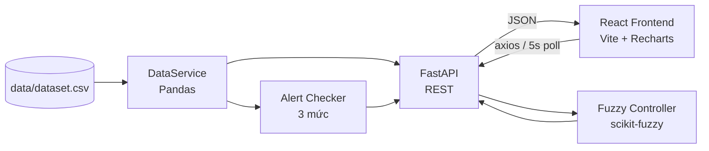

# 🏫 Air Quality Monitoring System

> Hệ thống giám sát chất lượng không khí trong phòng học/lớp học và điều khiển thiết bị bằng **Fuzzy Logic Control** — Full-stack web app (React + FastAPI).

[](https://www.python.org/)
[](https://nodejs.org/)
[](https://react.dev)
[](https://fastapi.tiangolo.com)
[](LICENSE)
[](#-fuzzy-logic-control)

---

## 📸 Demo

> Screenshots sẽ được thêm sau.

---

## 🏗️ Kiến trúc



**Luồng dữ liệu**: CSV → Pandas → FastAPI → React Dashboard (5s polling) + Fuzzy Control engine → API → UI.

---

## 📋 Mục lục

- [Tổng quan](#-tổng-quan)
- [Tính năng chính](#-tính-năng-chính)
- [Yêu cầu hệ thống](#-yêu-cầu-hệ-thống)
- [Cài đặt](#-cài-đặt)
- [Chạy ứng dụng](#-chạy-ứng-dụng)
- [Cấu trúc dự án](#-cấu-trúc-dự-án)
- [API Endpoints](#-api-endpoints)
- [Fuzzy Logic Control](#-fuzzy-logic-control)
- [Tài liệu tham khảo](#-tài-liệu-tham-khảo)

## 🎯 Tổng quan

Hệ thống này được thiết kế để:
- Giám sát các chỉ số môi trường trong phòng học theo thời gian thực
- Cảnh báo khi các chỉ số vượt ngưỡng
- Điều khiển tự động thiết bị thông gió/quạt dựa trên **Fuzzy Logic Control**
- Hiển thị dashboard trực quan với biểu đồ dữ liệu
- Sử dụng dữ liệu mô phỏng từ file CSV

### 🔍 Các chỉ số được theo dõi:
- 🌡️ **Nhiệt độ** (°C)
- 💧 **Độ ẩm** (%)
- ☁️ **CO2** (ppm)
- 💨 **PM2.5** (µg/m³)
- 🏭 **PM10** (µg/m³)
- 🚫 **TVOC** (ppb)
- ⚡ **CO** (ppm)
- 👥 **Lượng người trong phòng**

## ✨ Tính năng chính

### 1. **Dashboard Chính**
- Hiển thị thông tin hệ thống với tiêu đề chuyên nghiệp
- Thẻ (Card) hiển thị các chỉ số hiện tại với màu sắc trạng thái
- Dữ liệu cập nhật tự động mỗi 5 giây
- Điều khiển bật/tắt cập nhật tự động

### 2. **Biểu đồ Dữ liệu**
- Biểu đồ dòng thời gian cho CO2, PM2.5, Nhiệt độ, Độ ẩm
- Bộ lọc hiển thị: 10, 20, 50, hoặc tất cả dữ liệu
- Chọn các chỉ số muốn hiển thị
- Sử dụng thư viện Recharts

### 3. **Hệ thống Cảnh báo**
- Kiểm tra tự động và cảnh báo khi vượt ngưỡng
- 3 mức cảnh báo: Bình thường (Xanh), Cảnh báo (Vàng), Nguy hiểm (Đỏ)
- Danh sách cảnh báo realtime
- Thông tin chi tiết về từng cảnh báo

### 4. **Điều khiển Fuzzy Logic**
- Xây dựng thuật toán Fuzzy Logic Control
- Input: CO2, PM2.5, Độ ẩm, Lượng người
- Output: Mức thông gió (Low/Medium/High)
- Hiển thị kết quả Fuzzification và Active rules
- Hỗ trợ kiểm thử với giá trị tùy chỉnh

### 5. **Bảng Dữ liệu**
- Hiển thị dữ liệu chi tiết dạng bảng
- Phân trang (10, 20, 50, 100 dòng)
- Tìm kiếm theo thời gian
- Xuất CSV

### 6. **Trang Giới thiệu**
- Mô tả hệ thống và tính năng
- Kiến trúc hệ thống
- Thông tin công nghệ sử dụng
- Nền tảng lý thuyết Fuzzy Logic

## 🔧 Yêu cầu hệ thống

### Backend
- **Python 3.9+**
- FastAPI
- Pandas, Numpy
- scikit-fuzzy

### Frontend
- **Node.js 16+**
- React 18+
- Tailwind CSS
- Vite

### Dữ liệu
- File CSV chứa các cột: Timestamp, Temperature, Humidity, CO2, PM2.5, PM10, TVOC, CO, Occupancy_Count, Ventilation_Status

## 📦 Cài đặt

### 1. Clone hoặc tải dự án
```bash
cd c:\Users\ADMIN\Desktop\HTTM
```

### 2. Cài đặt Backend

#### 2.1 Tạo Virtual Environment (Khuyến nghị)
```bash
# Windows
python -m venv venv
venv\Scripts\activate

# Linux/Mac
python3 -m venv venv
source venv/bin/activate
```

#### 2.2 Cài đặt Dependencies
```bash
cd backend
pip install -r requirements.txt
```

### 3. Cài đặt Frontend

```bash
cd frontend
npm install
```

## 🚀 Chạy ứng dụng

### Phương pháp 1: Chạy cùng lúc

#### Terminal 1 - Chạy Backend:
```bash
cd backend
python main.py
```
Backend sẽ chạy tại: **http://localhost:8000**

API Docs (Swagger): **http://localhost:8000/docs**

#### Terminal 2 - Chạy Frontend:
```bash
cd frontend
npm run dev
```
Frontend sẽ chạy tại: **http://localhost:5173**

### Phương pháp 2: Sử dụng Uvicorn trực tiếp
```bash
cd backend
uvicorn main:app --reload --host 0.0.0.0 --port 8000
```

### Phương pháp 3: Build Production Frontend
```bash
cd frontend
npm run build
npm run preview
```

## 📁 Cấu trúc Dự án

```
HTTM/
├── frontend/                    # React Frontend
│   ├── src/
│   │   ├── components/         # Reusable components
│   │   │   ├── StatCard.jsx    # Thẻ chỉ số
│   │   │   ├── Header.jsx      # Tiêu đề
│   │   │   ├── Navbar.jsx      # Thanh điều hướng
│   │   │   ├── AlertPanel.jsx  # Panel cảnh báo
│   │   │   ├── Chart.jsx       # Biểu đồ
│   │   │   └── ControlOutput.jsx # Kết quả điều khiển
│   │   ├── pages/              # Page components
│   │   │   ├── Dashboard.jsx   # Dashboard chính
│   │   │   ├── Charts.jsx      # Trang biểu đồ
│   │   │   ├── Alerts.jsx      # Trang cảnh báo
│   │   │   ├── FuzzyDetails.jsx # Trang chi tiết Fuzzy
│   │   │   ├── Data.jsx        # Trang dữ liệu
│   │   │   └── About.jsx       # Trang giới thiệu
│   │   ├── services/
│   │   │   └── api.js          # API client
│   │   ├── App.jsx             # App component
│   │   ├── main.jsx            # Entry point
│   │   └── index.css           # Tailwind styles
│   ├── index.html              # HTML template
│   ├── package.json            # Dependencies
│   ├── vite.config.js          # Vite config
│   ├── tailwind.config.js      # Tailwind config
│   └── postcss.config.js       # PostCSS config
│
├── backend/                     # Python Backend (FastAPI)
│   ├── main.py                 # FastAPI app chính
│   ├── fuzzy/
│   │   ├── __init__.py
│   │   └── fuzzy_controller.py # Fuzzy Logic Controller
│   ├── services/
│   │   ├── __init__.py
│   │   └── data_service.py     # Data loading & management
│   ├── utils/
│   │   ├── __init__.py
│   │   └── alert_checker.py    # Alert checking logic
│   ├── requirements.txt        # Python dependencies
│   └── .env                    # Environment variables (optional)
│
├── data/
│   └── dataset.csv            # Dữ liệu mẫu
│
└── README.md                   # File này
```

## 🔌 API Endpoints

### Trang chủ
- `GET /` - Thông tin trang chủ

### Dữ liệu
- `GET /api/current-data` - Lấy dữ liệu hiện tại
- `GET /api/data-history/{count}` - Lấy `count` bản ghi gần nhất
- `GET /api/all-data` - Lấy tất cả dữ liệu

### Cảnh báo
- `GET /api/alerts` - Lấy danh sách cảnh báo hiện tại

### Điều khiển Fuzzy
- `GET /api/control-output` - Lấy kết quả điều khiển Fuzzy
- `POST /api/fuzzy-control` - Chạy Fuzzy Control với parameters tùy chỉnh

### Hệ thống
- `GET /api/system-info` - Thông tin hệ thống
- `GET /api/health` - Health check

### Swagger API Docs
- Truy cập: **http://localhost:8000/docs**

## 🧠 Fuzzy Logic Control

### Kiến trúc Fuzzy Control

#### 1. **Fuzzification** (Mờ hóa)
Chuyển đổi giá trị cảm biến thực thành giá trị mờ:

```
CO2 = 850 ppm
  -> Low: 0%
  -> Medium: 25%
  -> High: 75%
```

#### 2. **Rule Evaluation** (Đánh giá luật)
Áp dụng các luật mờ được định sẵn:

```
Luật 1: Nếu (CO2 cao HOẶC PM2.5 cao) → Ventilation = High
Luật 2: Nếu (CO2 trung bình VÀ Humidity cao) → Ventilation = Medium
...
```

#### 3. **Defuzzification** (Khử mờ)
Chuyển đổi kết quả mờ thành giá trị cụ thể:

```
Active Rules:
  - High: 75%
  - Medium: 25%
  
Output: Ventilation Level = (75 × 85 + 25 × 50) / 100 = 76.25
Fan Status = "High"
```

### Membership Functions

#### Input Variables:
| Variable | Range | Low | Medium | High |
|----------|-------|-----|--------|------|
| CO2 | 0-2000 ppm | 0-800 | 600-1800 | 1000-2000 |
| PM2.5 | 0-200 µg/m³ | 0-35 | 25-100 | 75-200 |
| Humidity | 0-100% | 0-40 | 35-70 | 65-100 |
| Occupancy | 0-60 people | 0-15 | 10-45 | 35-60 |

#### Output Variable:
| Ventilation Level | Range |
|-------------------|-------|
| Low | 0-33 |
| Medium | 25-75 |
| High | 67-100 |

### Cơ sở Luật (Rule Base)

```
1. HOẶC(CO2=High, PM2.5=High) → Ventilation = High
2. VÀ(CO2=Medium, Humidity=High) → Ventilation = Medium
3. VÀ(CO2=Low, PM2.5=Low, Occupancy=Low) → Ventilation = Low
4. Occupancy=High → Ventilation = High
5. PM2.5=High → Ventilation = High
6. HOẶC(CO2=Medium, Occupancy=Medium) → Ventilation = Medium
```

## 📊 Thông tin Dữ liệu

### Format CSV
```csv
Timestamp,Temperature,Humidity,CO2,PM2.5,PM10,TVOC,CO,Occupancy_Count,Ventilation_Status
2024-01-15 08:00:00,22.5,45.2,650,25.3,45.2,150,0.5,15,0
2024-01-15 08:05:00,22.6,45.5,680,26.1,46.2,155,0.6,18,0
...
```

### Ngưỡng Cảnh báo

| Chỉ số | Bình thường | Cảnh báo | Nguy hiểm |
|--------|-----------|---------|----------|
| CO2 | < 800 ppm | 800-1200 ppm | > 1200 ppm |
| PM2.5 | < 35 µg/m³ | 35-75 µg/m³ | > 75 µg/m³ |
| Humidity | 40-70% | < 40% hoặc > 70% | N/A |
| Temperature | 16-28°C | 14-30°C | N/A |
| TVOC | < 200 ppb | 200-400 ppb | > 400 ppb |
| CO | < 4 ppm | 4-9 ppm | > 9 ppm |

## 🎨 Giao diện Người dùng

### Trangicons & Emojis
- 🏫 HTTM System - Tiêu đề chính
- 📊 Dashboard - Trang chủ
- 📈 Biểu đồ - Trang biểu đồ
- ⚠️ Cảnh báo - Trang cảnh báo
- 🔧 Điều khiển Fuzzy - Trang Fuzzy Logic
- 📋 Dữ liệu - Trang bảng dữ liệu
- ℹ️ Giới thiệu - Trang thông tin hệ thống

### Màu sắc
- 🟢 **Xanh lá (Green)**: Bình thường, ổn định
- 🟡 **Vàng (Yellow)**: Cảnh báo, chú ý
- 🔴 **Đỏ (Red)**: Nguy hiểm, cần xử lý ngay

## 🔄 Auto-Update & Real-time

- Dashboard cập nhật mỗi **5 giây**
- Alerts cập nhật mỗi **10 giây**
- Dữ liệu mô phỏng từ CSV được lặp lại khi đến cuối

## 📝 Ghi chú

### File CSV
- Dữ liệu mẫu nằm trong thư mục `data/dataset.csv`
- Nếu các cột bị thiếu, chương trình sẽ điền giá trị mặc định
- Dữ liệu được làm sạch và forward fill khi có missing values

### Tính toán Fuzzy
- Sử dụng triangular membership functions
- Phương pháp defuzzification: Centroid
- Tất cả các luật được đánh giá để tìm độ mạnh

### Hiệu suất
- Frontend: Vite build rất nhanh
- Backend: FastAPI xử lý bất đồng bộ
- API response time: < 100ms

## 🐛 Troubleshooting

### Backend không khởi động
```bash
# Kiểm tra Python version
python --version  # Phải ≥ 3.9

# Kiểm tra dependencies
pip list

# Reinstall requirements
pip install -r requirements.txt --force-reinstall
```

### Frontend không kết nối API
```javascript
// Kiểm tra lại vite.config.js proxy settings
// Đảm bảo backend chạy tại http://localhost:8000
```

### CSV không được đọc
```python
# Kiểm tra file path trong backend/main.py
# Đảm bảo file tồn tại: data/dataset.csv
```

## 📚 Tài liệu Tham khảo

- [React Documentation](https://react.dev)
- [FastAPI Documentation](https://fastapi.tiangolo.com)
- [Tailwind CSS](https://tailwindcss.com)
- [Pandas Documentation](https://pandas.pydata.org)
- [Fuzzy Logic Theory](https://en.wikipedia.org/wiki/Fuzzy_logic)

## 📄 License

Free for educational and research purposes

---

**Phiên bản**: 1.0.0  
**Ngày tạo**: 2024  
**Tác giả**: HTTM Project Team
"# air-quality" 
"# air-quality" 
"# air-quality" 
"# air-quality" 
